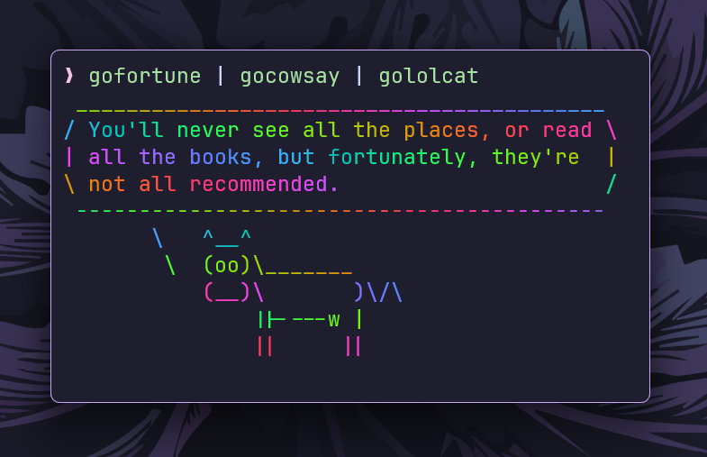

# pipe-trio

`pipe-trio` is a collection of **Go rewrites of three classic UNIX command-line
tools**: `fortune`, `cowsay`, and `lolcat`.



## Tools included

- [`gofortune`](./cmd/gofortune) - Generates random quotes from the fortune
  database.
- [`gocowsay`](./cmd/gocowsay) - Displays messages inside a speech balloon with
  ASCII figures.
- [`gololcat`](./cmd/gololcat) - Applies a colorful rainbow effect to text
  output.

## Installation

```sh
go install github.com/ashish0kumar/pipe-trio/cmd/...@latest
```

or build from source:

```sh
git clone https://github.com/ashish0kumar/pipe-trio.git
cd pipe-trio
make build
```

After installation, you can add the `bin/` directory to your `PATH` for easier
access to the commands:

```sh
export PATH=$PWD/bin:$PATH
```

## Usage

Use individual commands:

```sh
gofortune
echo "Hello, world!" | gocowsay
echo "This text will be colorful!" | gololcat
```

or combine them all like god intended:

```sh
gofortune | gocowsay | gololcat
```

## Why this project

It started as a fun weekend project because, well, why not? I love these UNIX
utilities and wanted to learn how they worked by building them. Plus, it was a
great way to dive into Go and explore system-level programming while keeping it
enjoyable.

## License

This project is licensed under the MIT License.
