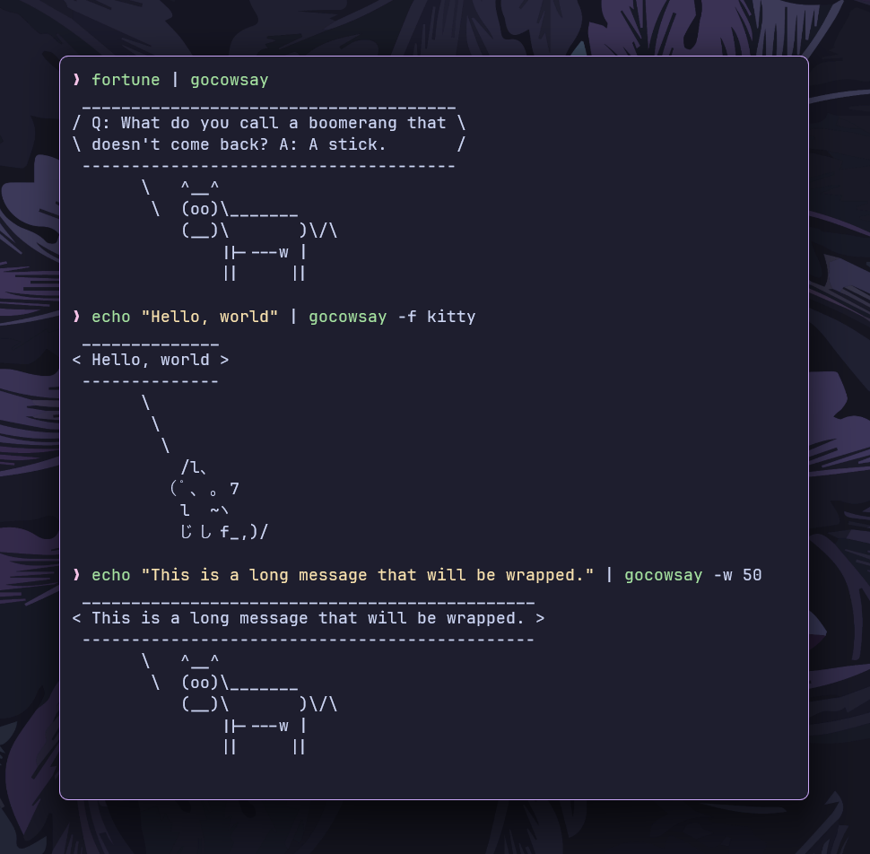

# `gocowsay`

`gocowsay` is a **Go implementation** of the classic `cowsay` command-line
tool. It takes **text input** (typically from a **pipe**) and displays it in a
**speech balloon** accompanied by an **ASCII figure**.



## Features

- Works seamlessly with **UNIX pipes**.
- Supports **multiple ASCII figures** like `cow`, `stegosaurus`, and `kitty`.
- Handles **multi-line** input and preserves paragraph formatting.
- Supports **text wrapping** with a **customizable width**.

## Installation

```sh
go install github.com/ashish0kumar/pipe-trio/cmd/gocowsay@latest
```

or build from source:

```sh
git clone https://github.com/ashish0kumar/pipe-trio.git
cd pipe-trio/cmd/gocowsay
go build -o gocowsay .
```

## Usage

`gocowsay` is designed to be used in a pipe:

```sh
fortune | gocowsay
```

You can specify an ASCII figure using the `-f` flag:

```sh
echo "Hello, world!" | gocowsay -f kitty
```

Customize the text wrap width using the `-w` flag:

```sh
echo "This is a long message that will be wrapped." | gocowsay -w 50
```

## License

This project is licensed under the MIT License.
