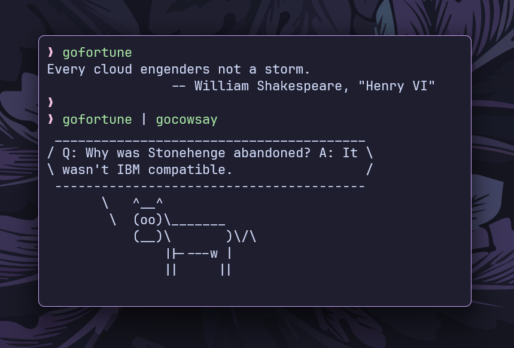

# `gofortune`

`gofortune` is a **Go implementation** of the classic `fortune` command-line
tool. It selects and **prints a random quote** from fortune files.



## Features

- Works seamlessly with **UNIX pipes**.
- **Fetches** fortunes from the system's **fortune directory**.
- **Filters out** invalid files (e.g., `.dat` and `off` directories).
- Uses a **random number generator** for quote selection.

## Installation

```sh
go install github.com/ashish0kumar/pipe-trio/cmd/gofortune@latest
```

or build from source:

```sh
git clone https://github.com/ashish0kumar/pipe-trio.git
cd pipe-trio/cmd/gofortune
go build -o gofortune .
```

## Usage

Print a random fortune:

```sh
gofortune
```

Use it in a pipe with `gocowsay`:

```sh
gofortune | gocowsay
```

## License

This project is licensed under the MIT License.
