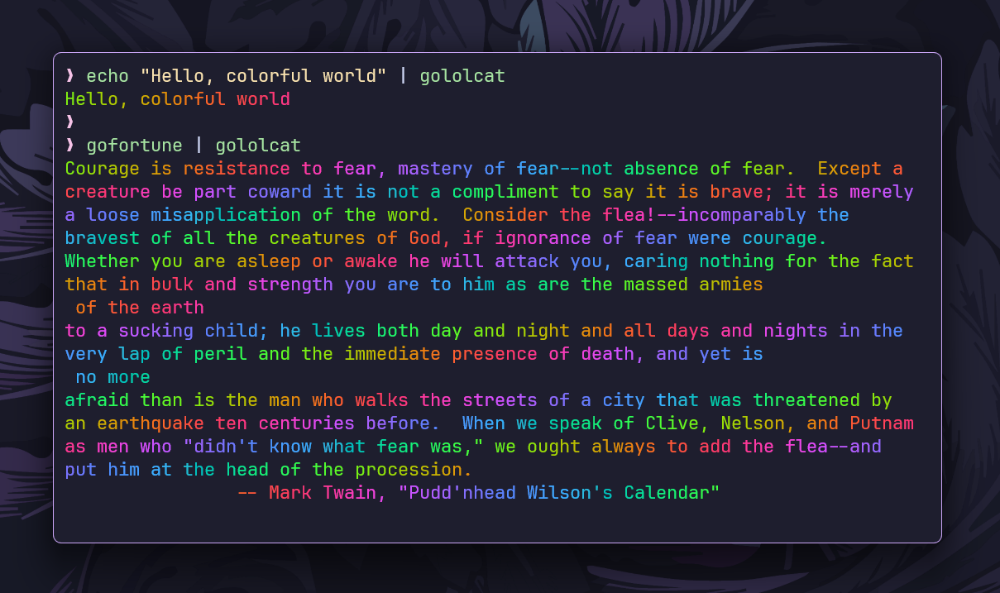

# `gololcat`

`gololcat` is a **Go implementation** of `lolcat`, a tool that colorizes text
output in a rainbow gradient. It reads text from **standard input** and prints
it with **RGB color formatting**.



## Features

- Works seamlessly with **UNIX pipes**.
- Applies a **smooth rainbow gradient** to text output.
- Supports **UTF-8 characters**.

## Installation

```sh
go install github.com/ashish0kumar/pipe-trio/cmd/gololcat@latest
```

or build from source:

```sh
git clone https://github.com/ashish0kumar/pipe-trio.git
cd pipe-trio/cmd/gololcat
go build -o gololcat .
```

## Usage

Colorize standard input:

```sh
echo "Hello, world" | gololcat
```

Use it in a pipe with `gofortune`:

```sh
gofortune | gololcat
```

## License

This project is licensed under the MIT License.
